```markdown
# System Flow Document: Interactive Apple-Style Ad Performance Dashboard

**Version:** 1.0
**Date:** June 20, 2025
**Author:** [Your Name/Role - e.g., Solutions Architect]

---

## 1. Document Header

*   **Project:** Interactive Apple-Style Ad Performance Dashboard
*   **Focus:** Web analytics, SQL, Python, Tableau, Adobe Analytics (style)
*   **Description:** ETL pipeline for ad performance and web metrics data, visualized in a Tableau dashboard with an Apple aesthetic, focusing on EMEA region.
*   **Deliverable:** GitHub repository with reproducible code, deployed components (Tableau Public, hosted ETL script).

---

## 2. System Overview

The Ad Performance Dashboard system is designed to provide comprehensive insights into digital advertising campaign performance and related web analytics, presented through an intuitive, Apple-style interface in Tableau. The system encompasses an automated data pipeline (ETL) that collects, processes, and stores performance data, making it accessible for detailed analysis and visualization.

**Key Components:**

*   **Data Sources:**
    *   Simulated/Anonymized Ad Delivery Data (CSV files or API endpoints).
    *   Simulated/Anonymized Web Analytics Data (inspired by Adobe Analytics metrics, likely included within the primary data source simulation or a secondary file/endpoint).
*   **ETL Process (Python):**
    *   **Ingestion:** Reading raw data from sources.
    *   **Cleaning & Transformation:** Processing data (handling missing values, standardizing formats, calculating metrics like AOV, deriving web metrics, joining data sources).
    *   **Loading:** Writing processed data into the Data Warehouse.
*   **Data Warehouse (PostgreSQL / Snowflake Mock):** A structured database storing the cleaned and transformed data. Serves as the single source of truth for reporting.
*   **Visualization Layer (Tableau):** Connects to the Data Warehouse to query data and render the interactive dashboard. Designed with specific tabs for different analytical views (Campaign Trends, A/B Test, Customer Lifecycle, Geo Segmentation - EMEA).
*   **Deployment Environment:**
    *   GitHub: Hosts the ETL code, SQL scripts, and project documentation.
    *   Hosting Platform (e.g., Cloud VM, Serverless Function): Runs the scheduled Python ETL script (Optional, for continuous updates if not running locally).
    *   Tableau Public: Hosts the interactive dashboard for public access.

**Interactions:**

The ETL process runs periodically (e.g., daily), pulling data from sources, processing it, and updating the Data Warehouse. The Tableau dashboard connects to the Data Warehouse to fetch the latest data whenever accessed, allowing users to interact with the refreshed information.

---

## 3. User Workflows

The primary user workflow revolves around accessing and utilizing the interactive Tableau dashboard to gain insights into ad performance and customer behavior.

**Primary Workflow: Accessing and Analyzing Dashboard Data**

1.  **User initiates access:** A user (e.g., Data Analyst, Marketing Manager) opens a web browser.
2.  **Navigate to Dashboard:** The user navigates to the deployed Tableau Public dashboard URL.
3.  **Dashboard Loads:** The Tableau dashboard application loads in the browser, connecting live to the Data Warehouse (via Tableau Public's data refresh mechanism or pre-extracted data depending on setup).
4.  **Explore Data Tabs:** The user interacts with the dashboard by selecting different tabs (Campaign Trends, A/B Test, Customer Lifecycle, Geo Segmentation - EMEA) to view various aspects of performance.
5.  **Apply Filters/Interactions:** The user utilizes interactive elements (filters, parameters, drill-downs) to refine the data view based on specific campaigns, dates, regions, etc.
6.  **Derive Insights:** The user analyzes the presented visualizations and data points to identify trends, understand campaign effectiveness, evaluate A/B test results, analyze customer cohorts, and identify regional performance differences.
7.  **Action/Decision:** Based on the insights, the user takes appropriate action (e.g., adjust campaign budget, modify targeting, optimize landing pages).

```mermaid
graph TD
    A[User] --> B(Web Browser);
    B --> C(Navigate to Tableau Public URL);
    C --> D(Tableau Dashboard Loads);
    D --> E{Explore Tabs & Filters};
    E -- Campaign Trends --> F1(View Campaign Performance);
    E -- A/B Test --> F2(Analyze Test Results);
    E -- Customer Lifecycle --> F3(Examine Cohorts/Funnels);
    E -- Geo Segmentation --> F4(Compare EMEA Regions);
    F1 --> G(Derive Insights);
    F2 --> G;
    F3 --> G;
    F4 --> G;
    G --> H(Take Action/Make Decision);
```



---

## 4. Data Flows

Data flows unidirectionally through the ETL pipeline into the Data Warehouse, from where it is consumed by the visualization layer.

**ETL Data Flow:**

1.  **Data Sources:** Raw ad delivery and web metrics data is available in source systems (simulated CSV/API).
2.  **Ingestion (Python):** The Python ETL script reads data from the specified source locations (file paths for CSV, API endpoints).
3.  **Cleaning & Transformation (Python/SQL):**
    *   Raw data is processed in Python.
    *   Data types are cast and validated.
    *   Calculations (AOV, conversion rates, session duration) are performed.
    *   Data might be reshaped or aggregated.
    *   SQL transformations (e.g., specific aggregations or joins) can be executed via Python against the staging area or directly in the warehouse.
    *   Data validation rules are applied (e.g., ensuring metrics are non-negative).
4.  **Loading (Python):** The cleaned and transformed data is loaded into designated tables within the Data Warehouse. This typically involves connecting to the database and executing INSERT or MERGE (UPSERT) statements.
5.  **Data Warehouse (PostgreSQL / Snowflake Mock):** The processed data resides in structured tables (e.g., a fact table for daily performance metrics, dimension tables for campaigns, dates, regions).
6.  **Visualization (Tableau):** Tableau connects to the Data Warehouse (read-only access) and queries the relevant tables based on the dashboard views and user interactions. Data is pulled from the warehouse into Tableau's data engine or directly queried depending on connection type.
7.  **End User:** The user views the data presented visually in the Tableau dashboard.

```mermaid
graph LR
    A[Simulated Ad Data<br>(CSV/API)] --> B(ETL Ingestion<br>Python);
    C[Simulated Web Metrics<br>(CSV/API)] --> B;
    B --> D(Data Cleaning & Transformation<br>Python/SQL);
    D --> E(Data Loading<br>Python);
    E --> F[Data Warehouse<br>PostgreSQL/Snowflake Mock];
    F --> G[Tableau Dashboard];
    G --> H[End User];
```

---

## 5. Error Handling

Robust error handling is critical to ensure the reliability and data integrity of the system, particularly the automated ETL process.

**Strategies:**

*   **ETL Script Logging:** Implement comprehensive logging within the Python ETL script. Log timestamped events, including:
    *   Start and end times of each stage (Ingestion, Transformation, Loading).
    *   Number of records processed at each stage.
    *   Warnings for data quality issues (e.g., rows with missing key values).
    *   Errors encountered during file reading, API calls, database connections, or query execution.
    *   Tracebacks for unhandled exceptions.
*   **Data Validation & Quarantine:**
    *   Implement data validation rules during the Cleaning & Transformation stage.
    *   Handle records that fail validation. Options include logging the error and skipping the record, or writing invalid records to a separate "quarantine" table in the Data Warehouse for later review and potential correction.
*   **Retry Mechanisms:** Implement retry logic for transient errors, especially database connection issues or temporary API unavailability, with exponential backoff.
*   **Alerting:** Configure the ETL execution environment (or add logic within the script) to send notifications (e.g., email, Slack message) to administrators upon critical failures (e.g., ETL script crash, failure to load data, consecutive retries failing).
*   **Database Error Handling:** Use database transactions during the loading phase. If loading multiple tables or a large batch of data, a transaction ensures that either the entire batch succeeds or the entire batch is rolled back, preventing partial data loads.
*   **Monitoring:** Monitor the scheduled ETL job execution status (e.g., using cron job logging, a simple monitoring script, or the hosting platform's monitoring tools). Monitor database health and performance. While not part of *this* project scope, in a production setting, dashboard load times would also be monitored.
*   **Graceful Failure:** Design the ETL script so that errors in processing one data source or one part of the transformation don't necessarily halt the *entire* process if other parts can continue safely.

---

## 6. Security Flows

Security in this system primarily focuses on protecting the sensitive (even if simulated/anonymized) data within the Data Warehouse and ensuring secure access for the ETL process and the visualization tool.

**Security Measures:**

*   **Data Anonymization/Simulation:** Since the deliverable includes a *public* GitHub repo and *public* Tableau dashboard, the primary security measure for protecting *real* sensitive data is ensuring the source data used is either simulated or thoroughly anonymized according to privacy best practices. No real customer or proprietary advertising data should be used directly without aggressive anonymization.
*   **Database Access Control:**
    *   **Authentication:** The ETL script and Tableau must authenticate with the Data Warehouse using credentials (username and password or token-based).
    *   **Authorization:** Define distinct database users or roles with the principle of least privilege:
        *   *ETL User:* Requires `INSERT`, `UPDATE`, `DELETE` (or `MERGE`) permissions on the specific tables it populates/updates. It does *not* need read access to unrelated tables.
        *   *Tableau User:* Requires `SELECT` permissions only on the tables required for the dashboard. It should *not* have write access.
*   **Credential Management:** Credentials for database access (used by the Python ETL script) should *not* be hardcoded directly in the script. They should be stored securely using environment variables, a secrets management tool (in a real production scenario), or configuration files outside the public GitHub repository (e.g., in a `.env` file read by the script but excluded by `.gitignore`).
*   **Secure Connections:** Use secure connection protocols (e.g., SSL/TLS) when connecting from the ETL script and Tableau to the Data Warehouse, especially if the database is hosted remotely.
*   **Hosting Platform Security:** If the ETL script is hosted on a server or cloud function, ensure the hosting environment is secured with appropriate access controls, firewalls, and monitoring.
*   **Tableau Public:** Be aware that Tableau Public is *public*. While the dashboard itself is accessible, the security here relies entirely on the source data being non-sensitive. The database credentials used during development/publishing in Tableau Desktop should *not* be embedded in a way that makes them accessible from the public workbook (using extracts refreshed on a schedule is safer than live connections for public dashboards).

```mermaid
graph TD
    A[ETL Script (Python)] -->|Authenticates & Authorizes| B[Data Warehouse<br>ETL User (Write)];
    C[Tableau Desktop/Public] -->|Authenticates & Authorizes| D[Data Warehouse<br>Tableau User (Read)];
    B -- Write Data --> E[Data Warehouse Tables];
    D -- Read Data --> E;
    subgraph Credential Management
        F(Secure Storage) --> A;
        F --> C;
    end
    subgraph Data Security
        G[Source Data<br>(Anonymized/Simulated)] --> A;
    end
    A -->|Secure Connection (SSL/TLS)| B;
    C -->|Secure Connection (SSL/TLS)| D;
```

---
```
